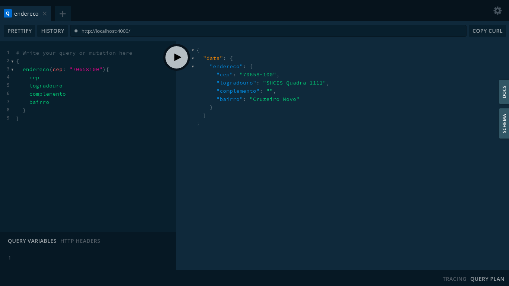

<h1 align="center">
  
</h1>

## Sobre o projeto
**ViaCEP GraphQL** é uma solução desenvolvida com **NodeJS + Apollo Server** que consome os dados da [**API REST ViaCEP**](https://api.graphql.jobs/) e disponibiliza uma **Query GraphQL** para consulta de endereço por CEP.

---

## Tecnologias utilizadas

- [NodeJS](https://nodejs.org/en/)
- [Apollo Server](https://www.apollographql.com/docs/apollo-server/)

---

## Como baixar e rodar o projeto

```bash

  # Clonar repositório
  $ git clone https://github.com/renanbrenovital/viacep-graphql.git

  # Entrar no diretório
  $ cd viacep-graphql

  # Instalar dependências
  $ yarn install

  # Iniciar o projeto
  $ yarn start

```

## Exemplo de consulta

```graphql

# Acessar o browser
  http://localhost:4000/

{
  endereco(cep: "70658100"){
    cep
    logradouro
    bairro
  }
}

```

---

## Sobre o Autor

Olá, me chamo **Renan Vital**.

Sou desenvolvedor **Fullstack Javascript** (com muitos anos de estrada no mundo da programação rs). Meu foco hoje é na parte visual de aplicações web e mobile (**UI e Frontend**) bem como na experiência do usuário (**UX**).

Sou um cara tranquilo, família e grato à Deus por por tudo que sou e tenho. Apaixonado por futebol, tecnologia e ávido por conhecimento!